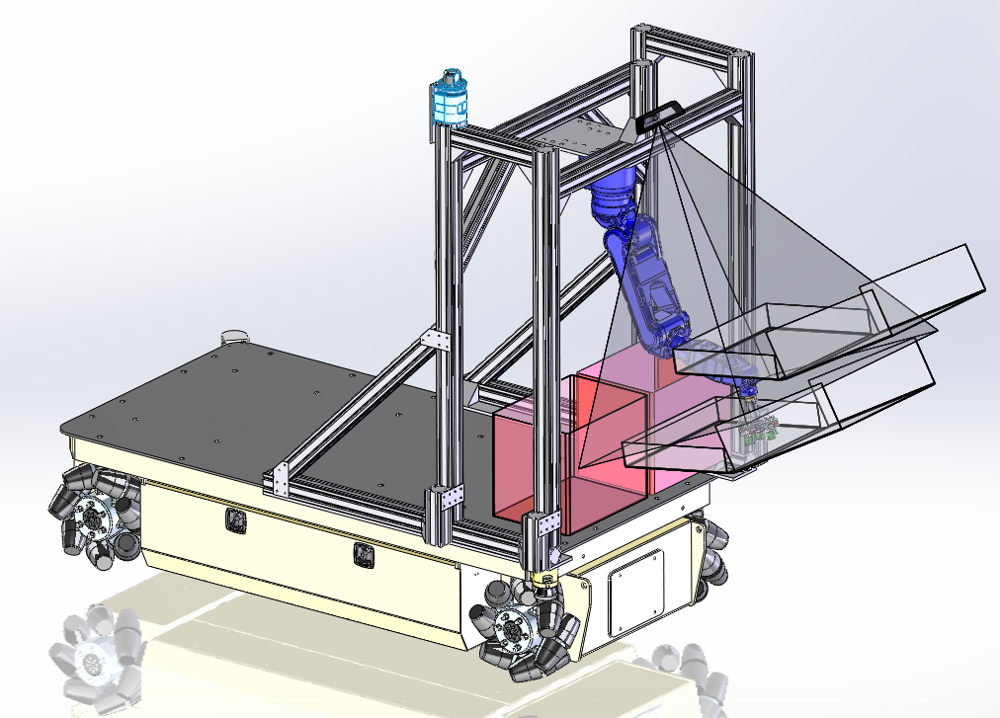

euler
=====

SwRI mobile manipulation platform



# Installation

The following installation instruction are broken into multiple parts: depedencies installed from source, ROS install, and, amos source install

## ROS Install

 1. Install ROS
Follow all the instructions to install the base version of ROS [Indigo](http://wiki.ros.org/indigo/Installation/Ubuntu): Install ROS-Deskstop Full. Please make sure you have followed all the ROS installation steps, including calls to `rosdep`.
 1. Get the wstool package
`sudo apt-get install python-wstool`

 1. Initialize the Euler workspace in your src directory.
```
wstool merge https://raw.githubusercontent.com/swri-robotics/euler/indigo-devel/euler.rosinstall
wstool update
cd ..
```
 1. Make sure dependencies are installed.  *Note: If this step fails then you may have to install dependencies manually using `sudo apt-get <package>`
`rosdep install --from-paths src --ignore-src --rosdistro hydro -y`
 1. Build Euler!
Assuming you are in the folder created above,
`catkin_make`
 1. Setup your environment
You will have to do this every time you work with this particular source install of the code. Assuming you are in the moveit folder created above,
`source devel/setup.bash`


Navigation Stage Demo
---------------------

To run the navigation demo with simulated input/driving (via [Stage](http://wiki.ros.org/stage_ros)), run the following command. 
 - `roslaunch euler_navigation_demo stage.launch`

Navigation Interface
--------------------

In its current state, the navigation configuration assumes a number of different topics in the euler namespace
 - `/euler/scan1` and `/euler/scan2` - navigation subscribes to the two LaserScans provided by the laser scanners on the base
 - `/euler/cmd_vel` - navigation publishes the Twist message used by the base for driving
 - `/euler/odom` - navigation subscribes to Odometry messages

In addition, it also assumes that the following transforms are published. 
 - `/odom --> /base_link`
 - `/base_link --> X` (where X is the frames for that the laser data is published in)
 - `/map --> /odom` - This is the localization step

The navigation configuration provides numerous topics for visualizing the robot's progress toward the goal, too many to list here. 

In terms of input, you can specify goals by publishing on the topic `/move_base_simple/goal`, which is what RViz does. However, the higher-level smach-compatibile Action interface is also available, as a [MoveBaseAction](http://docs.ros.org/api/move_base_msgs/html/action/MoveBase.html) with the namespace `/move_base`. 

## Hardware configuration

### Sick S300
The Sick S300 safety laser scanners have embedded controllers that require one-time configuration, most importantly to setup the protected zones.  The S300 is a serial device, but it ships with a USB to Serial (M8 4 conductor connector) cable that plugs into the front of the sensor.  The SICK [CDN software](https://www.mysick.com/eula.aspx?type=ZIP&path=saqqara/DC0000853&lang=en) is used for communication and configuration.  This [Quick Start Guide](http://www.sick.com/us/en-us/home/service/safetyhelp/Documents/S3000_S300_S300mini_QuickStart.pdf) is helpful.  The [full manual](https://www.mysick.com/saqqara/get.aspx?id=im0017613) gives all the details.  The Euler configuration project file is [here](euler_config/config/sick_s300/SICK%20S300%20Setup.skp).

